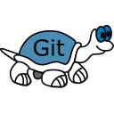

---

## 🤝 Connect with me:
<a href="https://www.linkedin.com/in/sambatra-andriamihaja-b439361b9/">
    
</a>
<a href="mailto:andriamihajasam@yahoo.com">
    
</a>
<a href="mailto:sambatra.andriamihaja@outlook.com">
    
</a>

---
## 👨🏻‍💻 A Little Bit About Me and My Interests

```yaml
name: Sambatra Andriamihaja
located_in: Antananarivo, Madagascar
current_job: Software Developer
current_company: MGBI (Madagascar Business Intelligence)
education: [
    "Master of Science degree in Big data Intelligence for Human Augmented Reality - ESTIA (Bidart, France) & ITUniversity (Antananarivo, Madagascar)",
    "Bachelor's degree in Computer Science, Development option - ITUniversity (Antananarivo, Madagascar)",
]
fields_of_interests: [
    "Software Development",
    "Web Development",
    "Artificial Intelligence",
    "Data Science",
    "UI/UX",
    "Game Development",
    "DevOps",
]
technical_background: [
    "Intern - Software Development",
    "End-of-Study Internship for Master's degree - Mobile App Development & Internet Of Things & Data Science",
    "End-of-Study Internship for Bachelor's degree - Web App Development"
]
currently_learning: [
    "Nginx",
    "Rust",
    "Odoo",
    "Elixir & Phoenix"
]
hobbies: [
    "Travel", 
    "Drawing", 
    "Art",
    "Music",
    "Gaming"
]
```
---  
  
## 🚀 Some Tools I Have Used and Learned
### Programming Languages
<p align="left">
    
    
    
    
    
    
    
    
    
    
</p>

### Frontend Development
<p align="left">
    
    
    
    
    
    
</p>

### Backend Development
<p align="left">
    
    
    
    
</p>

### Mobile App Development
<p align="left">
    
    
    
    
</p>

### AI/ML
<p align="left">
    
    
    
    
    
    
    
    
    
    
</p>

### Databases
<p align="left">
    
    
    
    
    
    
    
    
</p>

### DevOps
<p align="left">
    
    
</p>

### Backend as a Service (BaaS)
<p align="left">
    
    
</p>

### Frameworks
<p align="left">
    
    
    
    
    
</p>

### IDE
<p align="left">
    
    
    
    
    
    
    
    
</p>

### Server (Application Server & Web Server)
<p align="left">
    
    
</p>

### Versionning
<p align="left">
    
    
    
    
</p>

### Operating System
<p align="left">
    
    
</p>

### Other tools
<p align="left">
    
    
    
    
    
    
    
    
</p>


---